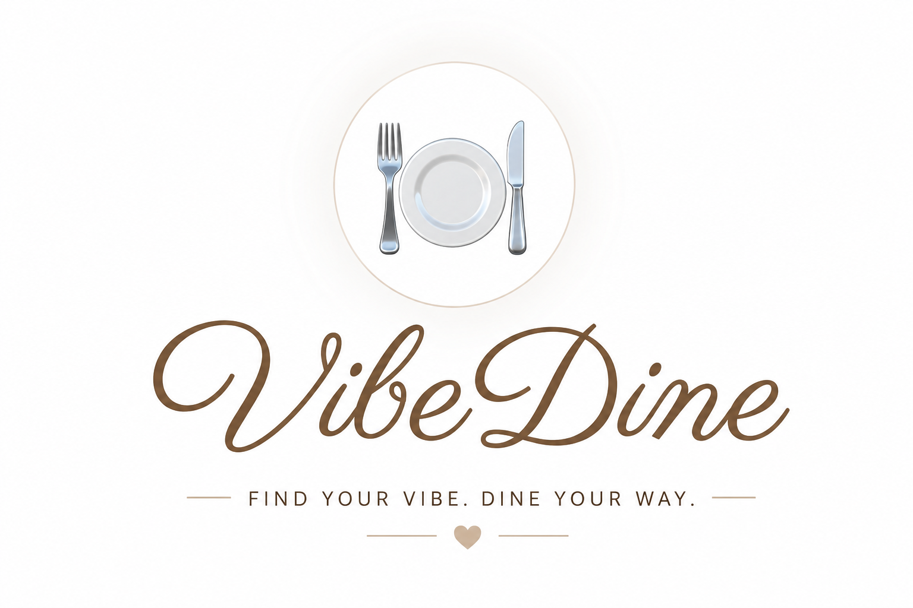

# VibeDine

**VibeDine** is a hybrid restaurant recommendation system developed to solve the **dining dilemma**.

Choosing where to eat is influenced by much more than cuisine, ratings, or distance. The right restaurant depends on the **moment**, the **people you're with**, and the **vibe** you're looking for.

To address this challenge, we built a recommendation system that combines **Content-Based Filtering** and **Item-Based Collaborative Filtering** to generate personalized restaurant recommendations.

The recommendation models were trained on the **Google Local Data (2021)** dataset, focusing on restaurants in California, allowing the system to recommend restaurants that better match each user's preferences and dining context.

---

## 📚 Documentation

Project documentation is available in the following files:

- [Installation Guide](install.md)
- [Project Summary](summary.md)
- [Modules Description](modules.md)

---
## About

This project was developed as part of the **Recommender Systems Workshop** at **Tel Aviv University**.

More information about the course can be found on the [Workshop Website](https://courses.cs.tau.ac.il/recsys/).

## 👥 Authors

Developed as part of the **Recommender Systems Workshop** at **Tel Aviv University**.

- Aya Rotbart
- Ester Tkach
- Liora Yaakov
- Yuval Hazut
- Yuval Namir Bar
---

## ✨ What Makes VibeDine Different?

  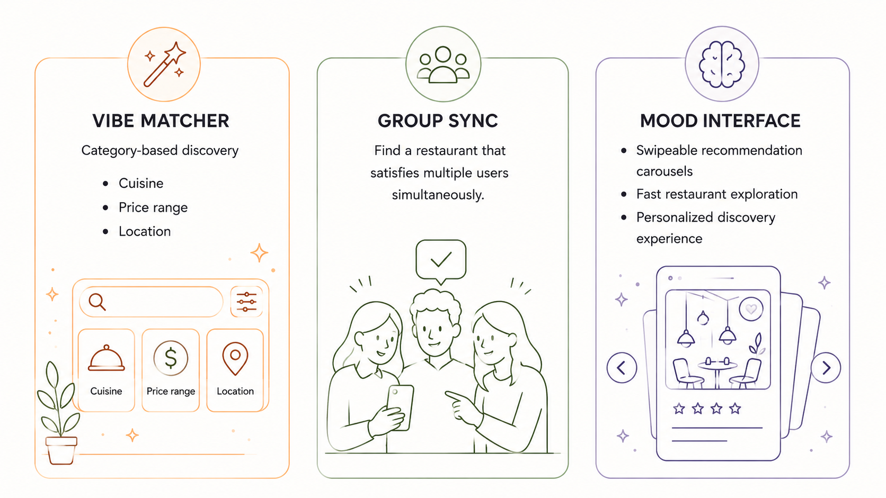

---

## 📸 Demo

### Home Page

  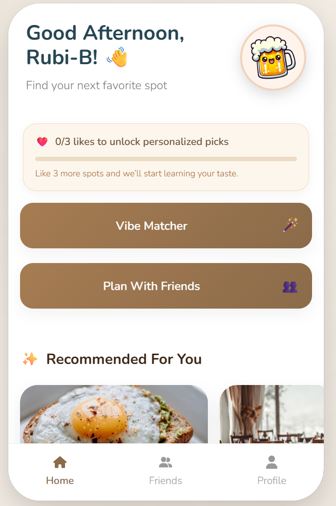

---

### Vibe Matcher

  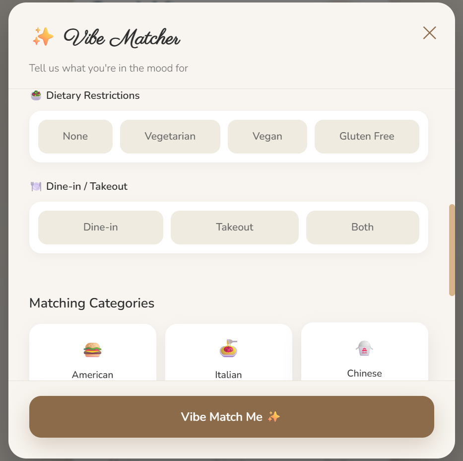

---

### Group Sync

  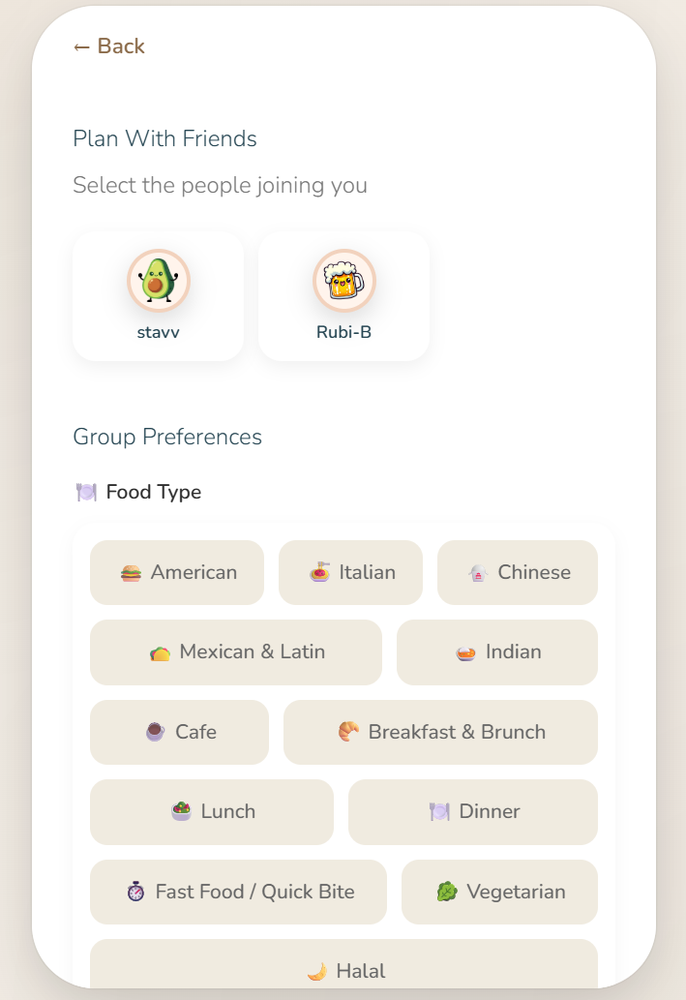

---

### Mood Interface

  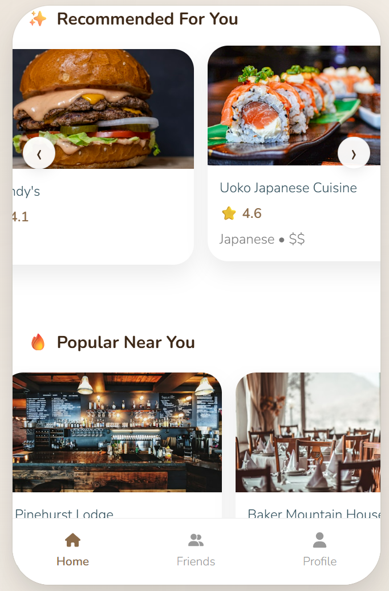

---

### User Profile

  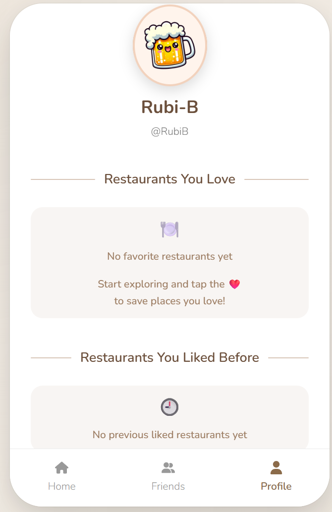

---

### Cold-Start Onboarding

  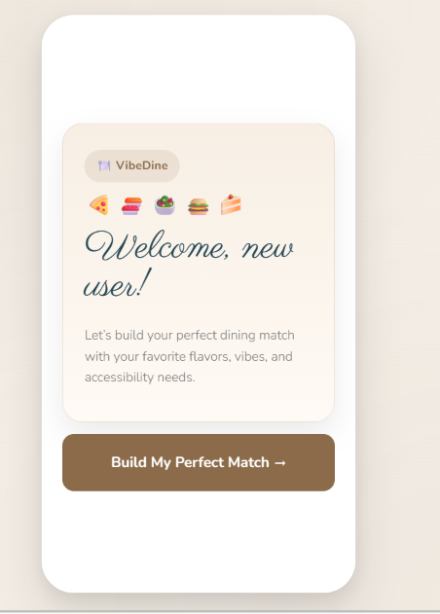
  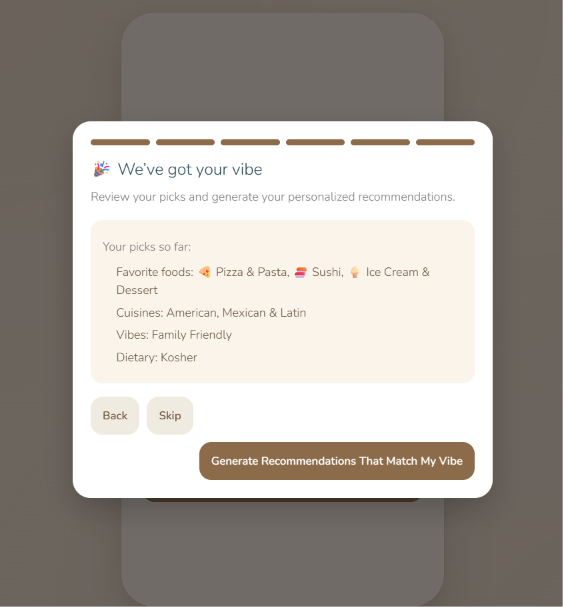
  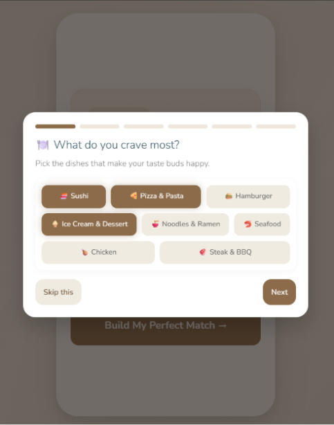

  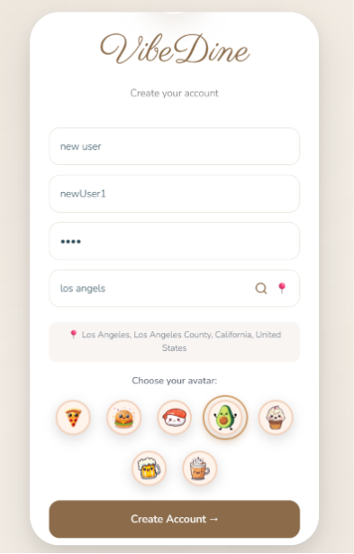

---

